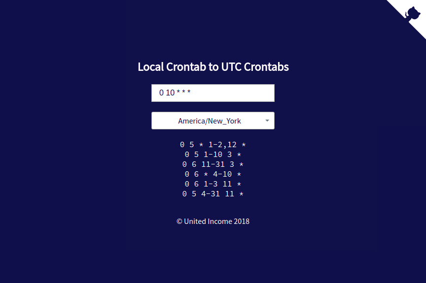

# local-crontab

A NodeJS library and utility to convert a crontab in a local timezone into a set of UTC crontabs. It
creates multiple UTC crontabs because of Daylight Saving Time.

## Use it online!
Check it out at [unitedincome.github.io/local-crontab](https://unitedincome.github.io/local-crontab)
[](https://unitedincome.github.io/local-crontab)

## Use as a script
```
$ npx local-crontab -h
usage: local-crontab [-h] [-v] [--tz TZ] CRONTAB

Convert local crontabs to UTC crontabs

Positional arguments:
  CRONTAB        A crontab in local time

Optional arguments:
  -h, --help     Show this help message and exit.
  -v, --version  Show program's version number and exit.
  --tz TZ        The timezone to use. Defaults to system timezone
$ npx local-crontab  '0 10 * * *' --tz America/New_York
0 5 * 1-2,12 *
0 5 1-10 3 *
0 6 11-31 3 *
0 6 * 4-10 *
0 6 1-3 11 *
0 5 4-31 11 *
$ npx local-crontab  '0 10 * * *' --tz America/Denver
0 3 * 1-2,12 *
0 3 1-10 3 *
0 4 11-31 3 *
0 4 * 4-10 *
0 4 1-3 11 *
0 3 4-31 11 *
```

## Use as a library
Install with `npm i local-crontab`, then:
```javascript
> const {localCrontabToUtcCrontabs} = require('local-crontab');
> localCrontabToUtcCrontabs('0 10 * * *', 'America/New_York')     
[ '0 5 * 1-2,12 *',                                               
  '0 5 1-10 3 *',                                                 
  '0 6 11-31 3 *',                                                
  '0 6 * 4-10 *',                                                 
  '0 6 1-3 11 *',                                                 
  '0 5 4-31 11 *' ]                                               
```
